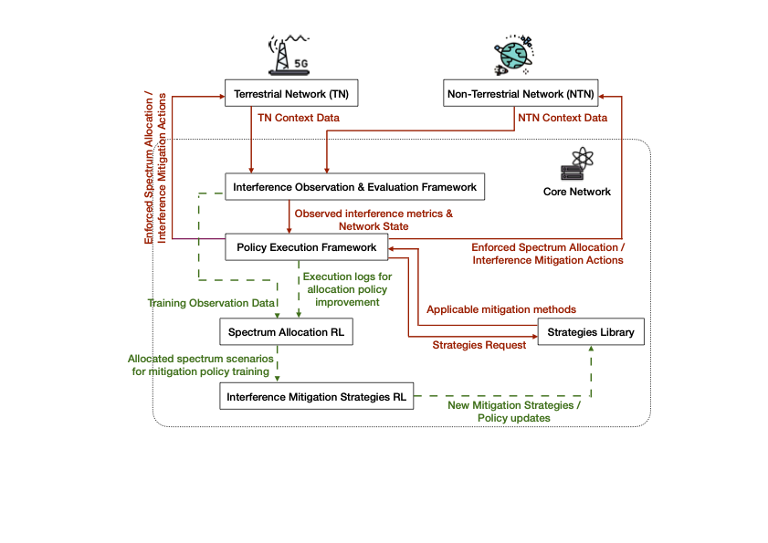

<h3 align="center"> Hi, I’m Chia</h3>


---


<br>
<p align="center">
  
  
</p>

<br>

---

<br>

### About Me 💫
> 🎓 **M.Sc. in Electrical Engineering, Information Technology, and Computer Engineering**  

> 🔬 I develop and analyse advanced systems spanning:  
> - TN/NTN communications
> - Secure network & protocol analysis

> 🎮 Personal Projects : Game Systems Prototyping

<br>

<p align="center">
<a href="Lebenslauf.pdf" target="_blank">
     </a>
</p>

---

### Projects 📚

<details open>
<summary><strong> Coexistence Analysis of TN and NTN in FR3</strong> (Temporarily Private)</summary>

 <!--
<p align="center">
  
</p>
-->

- MATLAB-based FR3 spectrum coexistence framework  
- WRC-23–aligned interference models  
- Rule-based vs. PPO reinforcement learning approaches for spectrum access  
</details>


<details open>
<summary><strong> Network Packet Analysis & Threat Profiling</strong> (In Progress)</summary>

<!--
<p align="center">
  
</p>
-->


- Python toolkit for deep packet inspection across L2–L7  
- Heuristic analysis for encrypted traffic + Suricata/Snort integration  
- Modular, protocol-agnostic analysis framework  
</details>

---
<br>

### Capabilities & Toolbox 🛠

| Domain                     | Tools & Methods                                                                                  |
|----------------------------|--------------------------------------------------------------------------------------------------|
| **Telecom & Satellite**    | OFDM • 3GPP NR • MIMO • Beamforming • Link-Budget • GNSS / LEO • 5G/6G analysis                  |
| **CyberSecurity**         | Packet analysis • Threat detection • Crypto protocols • Pen-testing (Nmap, Metasploit)           |
| **ML** | PPO-based RL • Deep learning for PHY optimization                                               |
| **Systems Design**         | Game prototyping • Telemetry architectures • Unity • Digital art (Procreate)                     |

<br>

---

<br>

### Languages 🌐

```text
    Mandarin:  ██████████ Native
    English:   █████████░ Fluent
    German:    ███████░░░ Good written and spoken skills
```

<br>

---

<br>

### Let’s Connect 📫

<br>

<p align="center">
  <a href="mailto:<chialeecc@gmail.com>" target="_blank"></a>
  <a href="https://steamcommunity.com/profiles/76561199487047339/" target="_blank"> </a>
</p>

<br>

<!-- Footer quote -->
<p align="center"><em>“Engineering is the art of directing great sources of power by intelligent application of science.” – H. L. Callendar</em></p>
